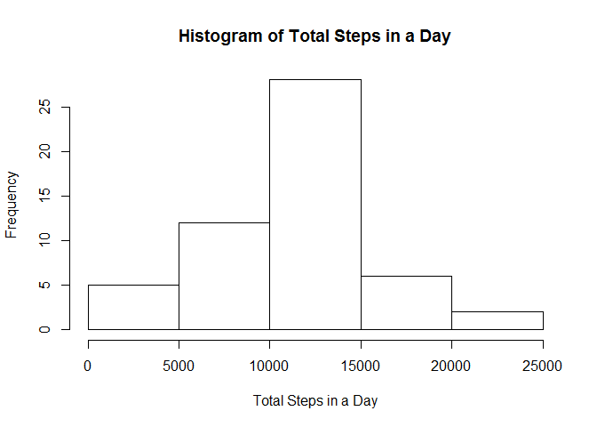
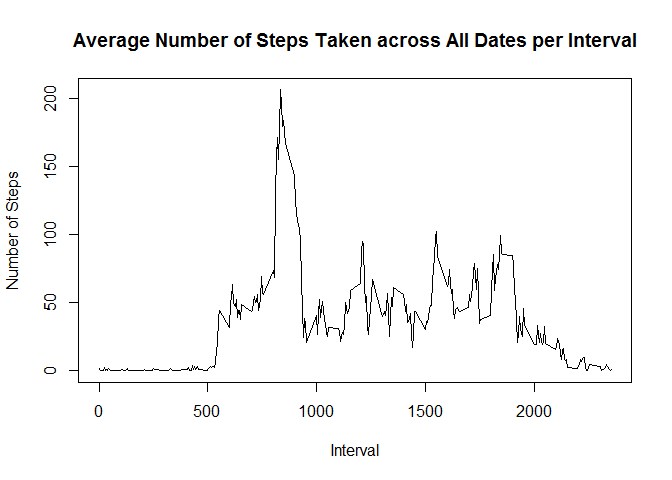
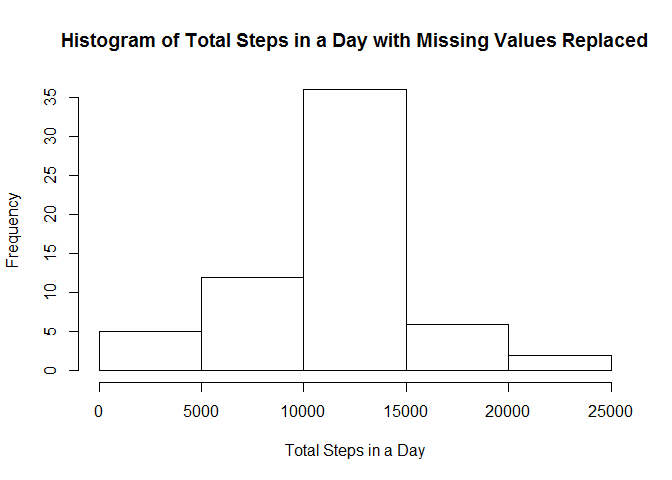

# Reproducible Research: Peer Assessment 1
Jose Enrico D. Leceta  


## Loading and preprocessing the data
First the packages needed have to be loaded.

```r
library(reshape2)
library(ggplot2)
library(lattice)
```

Then we read the data and save it to the variable *data* as well as fixing the data matrix.

```r
data <- read.csv("activity.csv", 
                 header = TRUE, 
                 na.strings = "NA", 
                 colClasses = c("numeric", "Date", "numeric"))
head(data, n = 5)
```

```
##   steps       date interval
## 1    NA 2012-10-01        0
## 2    NA 2012-10-01        5
## 3    NA 2012-10-01       10
## 4    NA 2012-10-01       15
## 5    NA 2012-10-01       20
```
By adding values for the arguments above, the data will be automatically fitted for analysis (more actions will be done on the "NA" values in the *steps* column in the next section).

## What is mean total number of steps taken per day?
The rows which have "NA" values in the *steps* column will have to be removed. The result will have to be saved in a different variable so as to not delete the original dataset.

```r
data2 <- data[!is.na(data$steps), ]
head(data2, n = 5)
```

```
##     steps       date interval
## 289     0 2012-10-02        0
## 290     0 2012-10-02        5
## 291     0 2012-10-02       10
## 292     0 2012-10-02       15
## 293     0 2012-10-02       20
```
It can be seen that the first 288 rows with "NA" values for the *steps* column were removed.  

The following code makes another data frame with the number of steps per date.

```r
data.melt <- melt(data2, 
                  id = c("date", "interval"), 
                  measure.vars = "steps")
steps.per.day <- dcast(data.melt, 
                       date ~ variable, 
                       sum)
head(steps.per.day)
```

```
##         date steps
## 1 2012-10-02   126
## 2 2012-10-03 11352
## 3 2012-10-04 12116
## 4 2012-10-05 13294
## 5 2012-10-06 15420
## 6 2012-10-07 11015
```

And then the histogram is made with another block of code:

```r
hist(steps.per.day$steps, 
     main = "Histogram of Total Steps in a Day", 
     xlab = "Total Steps in a Day", 
     ylab = "Frequency")
```

 

Calculation of the mean and median number of steps taken per day is done by the following:

```r
mean.steps.per.day <- mean(steps.per.day$steps)
mean.steps.per.day
```

```
## [1] 10766.19
```

```r
median.steps.per.day <- median(steps.per.day$steps)
median.steps.per.day
```

```
## [1] 10765
```

## What is the average daily activity pattern?
Using the "melted" data produced earlier, another data frame can be made which shows the average number of steps taken per interval on different days.

```r
steps.per.interval <- dcast(data.melt, 
                            interval ~ variable, 
                            mean)
head(steps.per.interval, n = 5)
```

```
##   interval     steps
## 1        0 1.7169811
## 2        5 0.3396226
## 3       10 0.1320755
## 4       15 0.1509434
## 5       20 0.0754717
```

The following block of code produces a line graph for the average number of steps per interval:

```r
plot(steps.per.interval$interval, 
     steps.per.interval$steps, 
     type = "l", 
     main = "Average Number of Steps Taken across All Dates per Interval", 
     xlab = "Interval", 
     ylab = "Number of Steps")
```

 

The interval at which the maximum average number of steps taken can be obtained by the following code:

```r
interval.max <- steps.per.interval$interval[
    steps.per.interval$steps == max(steps.per.interval$steps)]
interval.max
```

```
## [1] 835
```
As can be seen, the most activity is sometime before the 1000 interval and from that point to around before the 2000 interval, activity was around average. Activity at both ends are shown to be minimal.

## Inputing missing values
The number of rows with missing values can be easily obtained. Note that for this step, the variable *data* will be used as the variable *data2* is already clean.

```r
missing.count <- colSums(is.na(data))
missing.count
```

```
##    steps     date interval 
##     2304        0        0
```

```r
names(missing.count)
```

```
## [1] "steps"    "date"     "interval"
```

There are 2304 rows with missing values that needs to be filled up. For this part, the average number of steps taken per interval across all dates will be used as the *steps* value for particular rows with missing values. For this, *for loops* and *if statements* will be used. Again, to avoid overwriting the original data, a copy will be made in the variable *data3*.

```r
data3 <- data
data3.length <- length(data3$steps)
counter <- 1:data3.length
for(i in counter){
    if(is.na(data3$steps[i])){
        data3$steps[i] <- steps.per.interval$steps[
            steps.per.interval$interval == data3$interval[i]]
    }
}
head(data, n = 5)
```

```
##   steps       date interval
## 1    NA 2012-10-01        0
## 2    NA 2012-10-01        5
## 3    NA 2012-10-01       10
## 4    NA 2012-10-01       15
## 5    NA 2012-10-01       20
```

```r
head(data3, n = 5)
```

```
##       steps       date interval
## 1 1.7169811 2012-10-01        0
## 2 0.3396226 2012-10-01        5
## 3 0.1320755 2012-10-01       10
## 4 0.1509434 2012-10-01       15
## 5 0.0754717 2012-10-01       20
```

```r
head(steps.per.interval, n = 5)
```

```
##   interval     steps
## 1        0 1.7169811
## 2        5 0.3396226
## 3       10 0.1320755
## 4       15 0.1509434
## 5       20 0.0754717
```
The first 5 values earlier have now been changed from "NA" to the average number of steps taken across all days.  

The following part repeats the creation of the histogram and obtaining of the mean and median values above but using the new data set where the missing values were replaced.

```r
data3.melt <- melt(data3, id = c("date", "interval"), measure.vars = "steps")
steps.per.day2 <- dcast(data3.melt, date ~ variable, sum)
hist(steps.per.day2$steps, 
     main = "Histogram of Total Steps in a Day with Missing Values Replaced", 
     xlab = "Total Steps in a Day", 
     ylab = "Frequency")
```

 

```r
mean.steps.per.day2 <- mean(steps.per.day2$steps)
mean.steps.per.day2
```

```
## [1] 10766.19
```

```r
mean.steps.per.day
```

```
## [1] 10766.19
```

```r
median.steps.per.day2 <- median(steps.per.day2$steps)
median.steps.per.day2
```

```
## [1] 10766.19
```

```r
median.steps.per.day
```

```
## [1] 10765
```
As seen, the mean value is unchanged but the median value changed. The impact of replacing the missing values is basically adding more available dates (this is because the rows containing missing values comprised of whole dates). Thus with more dates, the middle value (median) might change. The mean is expected not to change because the average was used as the replacement for the missing values.

## Are there differences in activity patterns between weekdays and weekends?
The first step in this task is to determine whether a particular date is a weekday or a weekend:

```r
data3$weekday <- weekdays(data3$date)
for(i in counter){
    if(data3$weekday[i] == "Sunday" || 
       data3$weekday[i] == "Saturday"){
        data3$weekday[i] <- "weekend"
    } else{
        data3$weekday[i] <- "weekday"
    }
}
```

The data set should be modified in order to separate the weekday average and the weekend average:

```r
data3.melt2 <- melt(data3, 
                    id = c("date", "interval", "weekday"), 
                    measure.vars = "steps")
steps.per.interval2 <- dcast(data3.melt2, 
                             interval+weekday ~ variable, 
                             mean)
head(steps.per.interval2, n = 6)
```

```
##   interval weekday      steps
## 1        0 weekday 2.25115304
## 2        0 weekend 0.21462264
## 3        5 weekday 0.44528302
## 4        5 weekend 0.04245283
## 5       10 weekday 0.17316562
## 6       10 weekend 0.01650943
```

Finally, the comparison graph can be created using the following code:

```r
xyplot(data = steps.per.interval2, 
       steps ~ interval | weekday, 
       layout = c(1, 2), 
       panel = panel.lines)
```

 

As shown in the graph, the activity range is quite similar (around 750-2000). The spike in the left part is higher for weekdays than for weekends. The other parts of the graph seems higher for the weekends than for the weekdays especially the area around the middle. As expected, activity on both ends for both weekdays and weekends are minimal.
